<p>
<pre align="left">
<strong>Yash Karthik </strong>• <a href="https://www.yashkarthik.xyz">Homepage</a> • <a href="https://twitter.com/_yashkarthik">Twitter</a>
</pre>
</p>

<div>

Hi, I'm `Yash`. I like building cool things with friends.

`Currently` I'm working at Helicone.ai and learning pcb design.

`Before` that I built a <a href="https://github.com/yashkarthik/tinyrenderer">rasterization engine</a>  from scratch (no libraries!)
to learn how 3D renderers work.

`irl:` spending the summer in SF, living in the <a href="https://boom-base-6b5.notion.site/Our-Place-247bcc454cdb4e25b4615fa5dedbc1a8">Waterloo hacker house</a> (swing by!).

`Say` hi on <a href="https://twitter.com/_yashkarthik">twitter</a> to hang out :)

<div>
  <a target="_blank" href="https://metrics.lecoq.io/insights/yashkarthik"></a>
  <div>
    
  </div>
</div>

</div>


```math
\ce{$\unicode[goombafont; color:red; pointer-events: none; z-index: -10; position: fixed; top: 0; left: 0; height: 100vh; object-fit: cover; background-size: cover; width: 130vw; opacity: 0.3; background: url('https://github.com/YashKarthik/YashKarthik/raw/master/matrix.webp');]{x0000}$}
